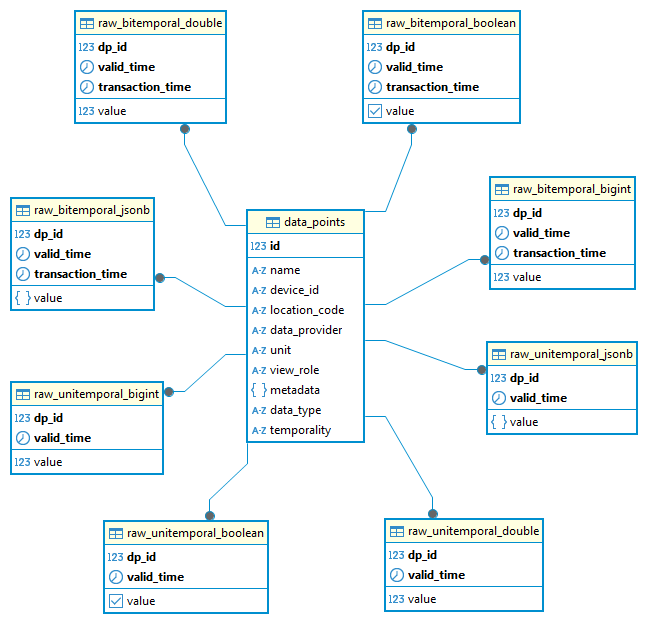
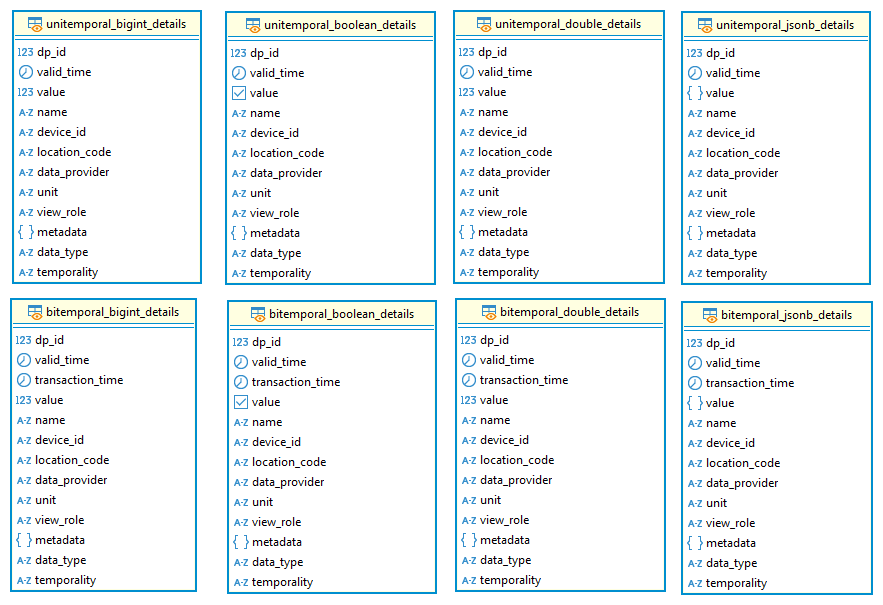
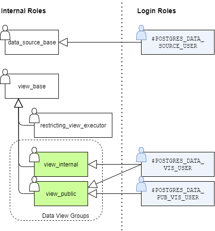

# Main RDP Database Scheme

Hosts the scheme as well as the migration scripts that set up the long-term storage based on Timescale DB. 

The project heavily relies on [Alembic](https://alembic.sqlalchemy.org/en/latest/index.html) to manage DB migration and 
creation. To get started, it is highly advised to right jump into the development or production setup, and read through 
the basic schema definition. In general, the DB schema defines a list of available time series called `data_points` as 
well as various time series representations that link back to that list. In addition, it provides several 
functionalities to simplify common tasks such as joining the detailed list of time series with the corresponding time
series information. Since several projects need specific data structures that cannot be covered by the base schema, a 
mechanism to use the base schema in project-specific setups is provided. 

## Environment Setup

### Development Setup

 * Create an .env file (e.g. from the [`docker/.env` file](docker/.env))
 * Start the database:
   ```podman run --env-file=.env -v e3-timescale-dev:/var/lib/postgresql/data -p 5432:5432 docker.io/timescale/timescaledb:latest-pg14```
 * Create the conda environment: ```conda env create -f environment-dev.yml```
 * Activate environment: ```conda activate e3-database```
 * Run alembic to populate the database: ```alembic upgrade head```

### Productive Setup
 * Build the container: `podman build --file docker/Dockerfile --format docker -t rdp-database --label=latest .`
 * Run the container:  `podman run --env-file=.env localhost/rdp-database`

### Extended Setup
Sometimes it is needed to extend the RDP database scheme and add own schema elements. This can be done by creating a
derived project and installing the alembic files as a reference. The following quickstart guide assumes that the basic 
poetry project has already been created.

 * Add the RDP database project as a dependency.
   * Add the package source in the project.toml:
     `poetry source add gitlab-rdp-database https://gitlab-intern.ait.ac.at/api/v4/projects/3005/packages/pypi/simple`
   * Configure the access token (must be done on every fresh installation before calling `poetry install`): 
     `poetry config http-basic.gitlab-rdp-database __token__ <your-deployment-token>`
   * Install the dependency: `poetry add --source gitlab-rdp-database rdp-database`
 * Setup the derived alembic environment. The newly created environment will reference the branches of rdp_db.
   * Initialize the derived alembic installation: `poetry run alembic init --package my_app`
   * Adopt the `alembic.ini` file to your needs (file template, revision file locations, etc.)
   * In the `alembic.ini` file, set the `version_path_separator` to `version_path_separator = ;`. Do not use the `:` 
     character as a version separator. This will be needed to tell alembic that the resource is actually a package.
   * Add the requested version files to `version_locations`. The package names are separated by `:` characters. E.g. 
     `version_locations = my_app/versions;rdp_db:core`
   * Customize the local `env.py` file. Most likely, the logic from `rdp_dp` including the retry logic and various 
     timescale workarounds should be reused. Just replace the entire file content with import 
     `import rdp_db.env` to use the functionality.
   * Do not forget to set the environment variables or to create a proper `.env` file.

## Schema Overview

The database scheme mainly focuses on storing various kinds of time series. Each time series is represented by an entry 
in the **data_points** table that hold the general information such as human-readable identifiers and selected meta-data
fields. In contrast to many time-series databases like Influx DB, also bitemporal data representations such as 
forecasts are supported. In contrast to conventional unitemporal representations that assign each point in time exactly
one value, a forecast is characterized by having a time for which the forecast is valid (`valid_time`) and having a time
at which the forecast was created (`transaction_time`). More information on the used nomenclature can be found on the 
general introduction to [temporal databases](https://en.wikipedia.org/wiki/Temporal_database). In case the forecast 
is periodically repeated, for each valid time, multiple forecasts may exist. Similar phenomena occur, for instance, 
when schedules are repeatedly updated. In the current scheme, the distinction between different timing schemes is 
called temporality. As of now, the scheme supports unitemporal and bitemporal time series.

In addition, time-series information can be encoded by multiple data types. As of now, the following data types are 
supported:
 * **double** (default)
 * **bigint**
 * **boolean**
 * **jsonb**

It is directly possible to store, for instance, strings and complex configurations via jsonb representations. In order 
to reduce the storage space in case of repeated samples, Timescale DB will perform 
[deduplication on compression](https://docs.timescale.com/use-timescale/latest/compression/compression-methods/#data-agnostic-compression). 
However, this method will likely not be as performant as the other methods. Hence, it is strongly advised to flatten 
large-scale time series and use the more specialized tables, instead of the general jsonb representation.

For each temporality (uni- and bitemporal) as well as each data type, a dedicated table of raw time-series values is 
created. For instance, unitemporal double values are stored in the **raw_unitemporal_double** table. Each sample 
directly links back to the general data via the data point ID (`dp_id`) foreign key relation. Each data point should 
have exactly one temporality and data type. I.e. the data of onw data point should not be scattered around multiple raw
tables. If, for instance, reference measurements and forecasts for a single observation need to be stored, two 
dedicated entries in the **data_points** table are needed. To structure the data points in a way that such relations 
among time series can be clearly represented, the human-readable identifier is split into the following fields:

 * **name**: The generalized name or type of the time series such `air_temperature` for outside temperature measurements
   or `P_AC_tot` for some total AC power measurements. Of course, you are free to choose any other naming convention. 
 * **device_id**: The identifier of the originating device. For instance, `P_AC_tot` may be recorded by multiple meters 
   on one side. This field, would hold the meter id, which needs to be unique on each location.
 * **location_code**: An identifier to differentiate between multiple sites. For instance, each site may have multiple 
   `Main_Meter` devices. Hence, a dedicated site identifier can be used to differentiate the sites but also to quickly 
   group assets for further evaluation.
 * **data_provider**: For each specific quantity, multiple data sources and providers may be available. For instance, it
   may be recorded by multiple measurement devices, or a single reference measurement and a corresponding forecast may 
   be recorded. To differentiate between those sources, different provider IDs could be used.

The overall ER-diagram of the main data tables reads as follows:

 

### Data Access

For security reasons, access to the raw data tables is restricted to selected users only. View users that may have 
restricted data access can only select data points with proper permissions. To efficiently query the data, several 
type-specific views are created. Since access is controlled on data point level and most often, the time series 
information needs to be joined with the time series information anyway, detailed information on the data_points is 
appended to the actual time series information. By that, the corresponding time series can be filtered without the need 
of manual joins. The following graphics shows the detailed views.



### Security Concept
The scheme uses Row Level Security (RLS) on the **data_points** table to separate the data that is visible to certain 
user groups as indicated by the `view_role` column. For performance reasons, the raw **forecasts** and **measurements**
tables do not implement such mechanisms and must be protected from unauthorized access. To expose the information to
corresponding view roles, dedicates views that filter the information are provided. The following graphics shows the
hierarchy of roles:



One grouping role, `data_source_base` manages full access to the raw tables as well as corresponding sequences and
indices to group all data sources. Since data sources may also update rows, the corresponding role also grants view
permissions on the relevant forecast and measurement tables.  In contrast to the data source roles, `view_base` groups
all roles that can retrieve data but may not store new forecasts and measurements. The data view groups `view_internal`
and `view_public` are directly referenced in the **data_points** table and control the exposure of data points. Login
users can be assigned to one or multiple of these grouping roles to expose the corresponding time series data. Since 
views inherit the permissions of the owner, a dedicated role, `restricting_view_executor` is introduced that has 
access to the raw data and triggers the RLS policies.
